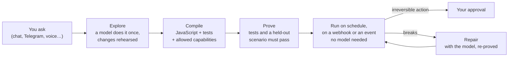

<p align="center">
  
</p>

<h1 align="center">Pimpo</h1>

<p align="center">
  A personal AI agent that learns a task once, then does it on its own.
</p>

<p align="center">
  <a href="https://github.com/turbine-dev/pimpo/actions/workflows/ci.yml"></a>
  <a href="https://github.com/turbine-dev/pimpo/actions/workflows/desktop.yml"></a>
  <a href="https://github.com/turbine-dev/pimpo/releases"></a>
  <a href="LICENSE"></a>
</p>

---

You ask in plain words: *"every morning, send me my agenda and the emails that matter"*. The first time, Pimpo does it with a language model while you watch, rehearsing every change before it touches anything. When it works, Pimpo **compiles the task into a routine**: readable JavaScript with tests and a list of the only things it may touch. From then on the routine runs on schedule **without a language model**. A small judgment model answers the few subjective questions ("is this email important?").

- **Reliable.** A routine is code with tests, not a prompt re-read every night.
- **Cheap.** Routines cost cents, not dollars. It works with the model subscriptions you already have: Claude Code, Codex, opencode, or local models.
- **Safe by construction.** Routines reach the world only through declared capabilities. Every action passes your rules and lands in a tamper-evident log, and anything irreversible waits for your approval.
- **Yours.** Runs on your computer, keeps your data there, exports everything to one file. No telemetry.

## How it works



## What it does

- **Routines** you ask for in plain words, or install from a gallery of signed, audited ones: morning briefings, email triage, bills, price watches, news summaries read aloud as a podcast, reminders, and anything you can describe.
- **Connections** to email, calendars, Google Sheets, GitHub, Notion, Todoist, Home Assistant, Apple apps, Spotify, web search, RSS and more. Any **MCP server**, any **REST API with an OpenAPI description**, or a **JSON file** adds a new one without recompiling.
- **Everywhere you are:**

  | | |
  |---|---|
  | **Desktop** | macOS, Windows and Linux: menu bar, starts at login, system notifications |
  | **Web** | the full app at `http://127.0.0.1:7788`, installable as a PWA |
  | **Phone** | iOS and Android companion, paired by QR code, for approvals and receipts |
  | **Chat** | Telegram, WhatsApp (official API), email, Slack, Discord, Signal, voice notes, or any bridge through the channel API |

- **Your choice of models:** Claude Code, Codex and opencode through your own subscriptions; Anthropic, OpenAI, Google Gemini, OpenRouter, DeepSeek, Groq, Mistral, xAI or any OpenAI-compatible API; Ollama and LM Studio locally. Pimpo picks the model and thinking level per task, or you do, and it keeps what your subscription covers apart from what you pay.
- **Voice:** listen to answers and routines with local voices (Kokoro, Piper) or cloud ones (OpenAI, ElevenLabs), and talk to it with local Whisper. Pimpo downloads local models itself, verified by checksum.
- **A whole house:** people with roles, their own memory and accounts, approvals sent to whoever is responsible.
- **Community protection:** a signed list of exfiltration domains and dangerous patterns, which also guards OpenClaw and Hermes through the [Guard plugins](guard/).
- **Portable:** export everything to one encrypted file, back up to S3 or Google Drive, import from OpenClaw or Hermes.

## Install

**Desktop app.** Download the installer for your system from the [latest release](https://github.com/turbine-dev/pimpo/releases): `.dmg` for macOS (Apple Silicon or Intel), `.exe` or `.msi` for Windows, and `.deb`, `.rpm` or `.AppImage` for Linux (x64 or arm64).

**Command line and servers** (Linux, macOS, Raspberry Pi):

```bash
curl -fsSL https://raw.githubusercontent.com/turbine-dev/pimpo/main/scripts/install.sh | sh
```

Add `--service` to run it at boot with systemd. Then start it and open the address it prints:

```bash
pimpo serve
```

To look around first without connecting any account or spending on models:

```bash
pimpo serve --demo
```

Exploring and compiling routines uses a model: the simplest start is [Claude Code](https://claude.com/claude-code) signed in with your plan. Everything else runs on your computer.

## Documentation

| | |
|---|---|
| [User guide](docs/USER_GUIDE.md) | everything you can do, screen by screen |
| [Configuration](docs/CONFIGURATION.md) | commands, settings, models, channels, the data folder, network and backups |
| [Routines](docs/ROUTINES.md) | how routines are made, their format, triggers, tests, and writing one by hand |
| [Connectors](docs/CONNECTORS.md) | adding services: JSON connectors, OpenAPI import, MCP servers and programs |
| [Extending Pimpo](docs/SDK.md) | the channel, judge and Guard APIs, the gallery and the protection list |
| [Threat model](docs/THREAT_MODEL.md) | what Pimpo promises, and against whom |

All of it is indexed in [docs/](docs/README.md).

## Build from source

```bash
git clone https://github.com/turbine-dev/pimpo.git && cd pimpo
make build
./bin/pimpo serve --demo
```

Requires Go (the toolchain in `go.mod` downloads itself) and Node 24. `make desktop` builds the desktop app (it needs Rust and the [Tauri prerequisites](https://tauri.app/start/prerequisites/)), and `make check` runs every check. See [CONTRIBUTING.md](CONTRIBUTING.md).

## Contributing

Contributions are welcome, and the easiest way in needs no Go: a connector is often a single JSON file. Read [CONTRIBUTING.md](CONTRIBUTING.md), the [Code of Conduct](CODE_OF_CONDUCT.md) and [how the project is governed](GOVERNANCE.md). For help, see [SUPPORT.md](SUPPORT.md).

**Security issues** are reported privately: see [SECURITY.md](SECURITY.md).

## Status

Pimpo is young and moves fast. See [what changed](CHANGELOG.md), [what is done and what waits](docs/STATUS.md), and [how releases are supported](docs/RELEASES.md).

## License

[Apache License 2.0](LICENSE). Free and open source, with no telemetry.
